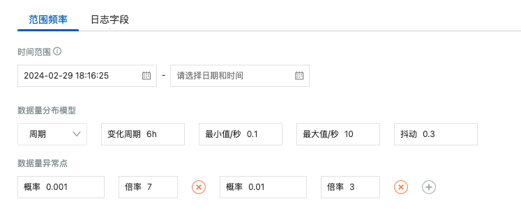
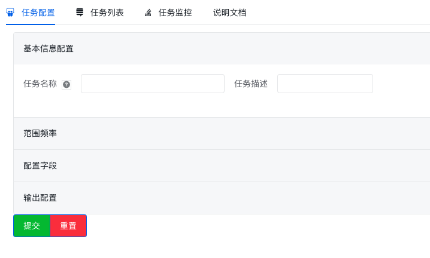
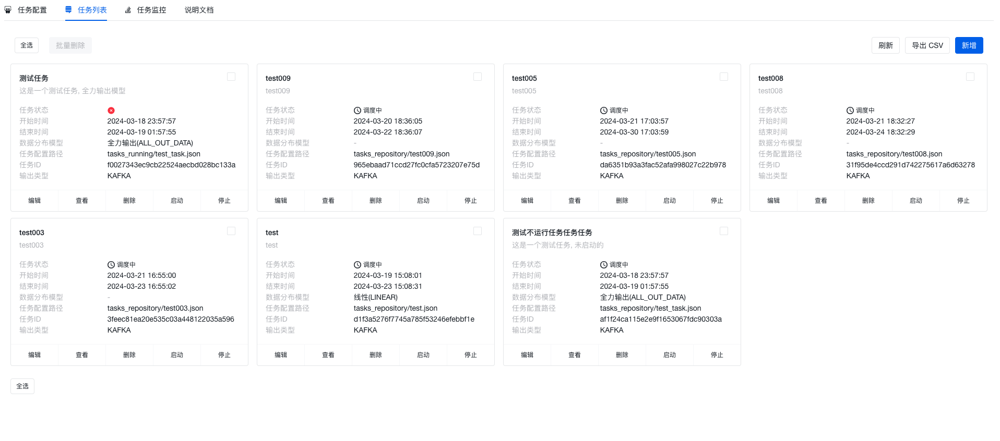
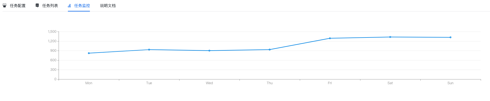
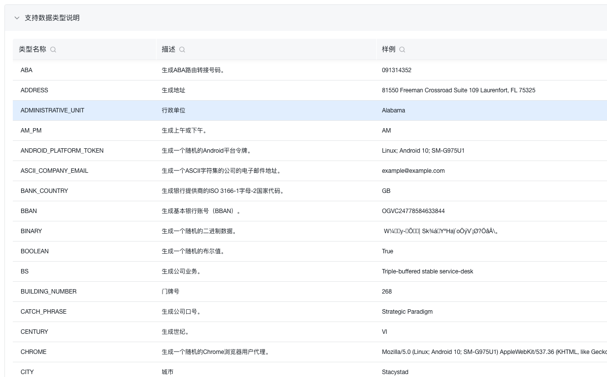

# 目的

- 项目上需要一个发送大量数据的脚本，但是现在的都比较难用，而且对测试，一线人员等都不友好，压测机器也比较难用
- 需要一个操作简单，发送大量数据的工具
- 具有可结合的多场景的（类似于阿里的数据模拟接入）

# 使用说明：
python版本依赖：3.11.0 ，使用poetry进行包管理。
- git clone https://github.com/zhanbei1/data-generator.git
- cd data-generator
- poetry虚拟环境安装（环境已经有的可以忽略）
  - 全局环境安装poetry： pip3 install poetry
  - 查询虚拟环境：python3 -m poetry env list
  - 创建虚拟环境：python3 -m poetry env use xxxx
  - 激活属于该项目的环境：python3 -m poetry env use xxxx
- 安装依赖：python3 -m poetry poetry install
- 启动服务：bash bin/data-generator-start.sh api|core|all
  - api：启动api服务，分布式的时候，可以只在某个节点上启动api，作为master管理节点
  - core：启动核心服务, 分布式的时候，可以在子节点上只启动core
  - all：启动全部服务，单点部署的时候，可以全部启动
- 访问地址：http://127.0.0.1:8000/ （默认）

###在线体验：
在线体验：[data-generator.xiaopang.cool](http://data-generator.xiaopang.cool/)
域名不通可以直接访问：[http://47.101.222.92/](http://47.101.222.92/)

## 创建任务
配置产生数据的任务，包括频率，异常点，数据类型，数据模型，数据发送场景，数据发送时间范围等

## 任务列表
展示所有任务，可以查看任务状态，任务详情等，同时在列表页可以进行删除启停等额外操作

## 任务详情
展示任务详情，可以查看任务状态，发送的数据量，任务运行详情等。

##  说明文档
展示说明文档，可以查看使用说明，使用文档，架构文档，支持的数据类型等说明。

# 工具特点

- 操作简单，可以通过api提交任务，或者使用简单页面提交任务
- 后端通过文件形式管理配置，不依赖任何第三方组件，使用轻量化
- 可以发送大量数据，python使用大量进程进行发送数据
- 可以预设发送数据模型，提前预览数据模型的数据发送曲线
- 数据类型可以随意拼接，符合多种场景
- 发送场景可以合并，形成一个更加广泛的场景

# 项目使用简介

- 数据类型产生：Faker
- 调度引擎：x
- 配置模版解析：Pydantic
- 接口框架：fastAPI
- 前端低代码：amis
- 包管理：poetry
- 内置核心算法：x
- python版本：3.11.0+

# 其他说明

[使用说明](./docs/user-manual.md)

[支持类型说明](./docs/data-type.md)

[任务配置说明](./docs/task-configration.md)

[项目架构设计说明](./docs/project-construct.md)