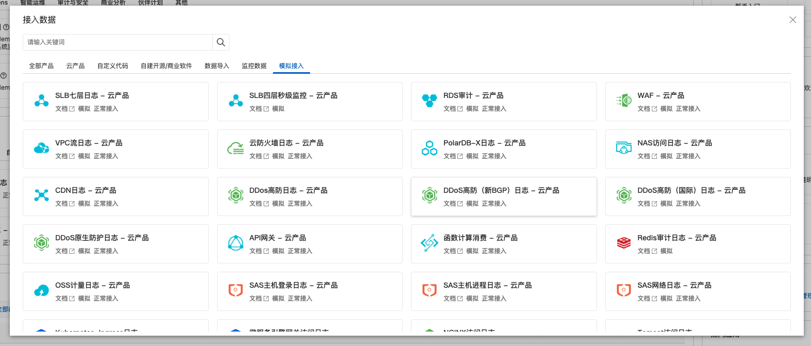
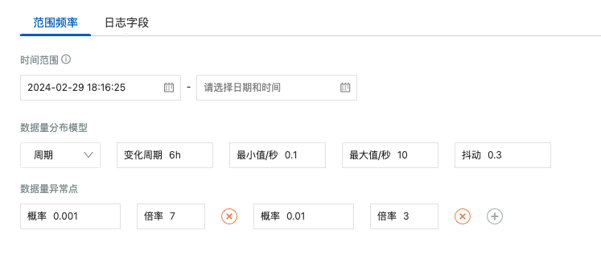
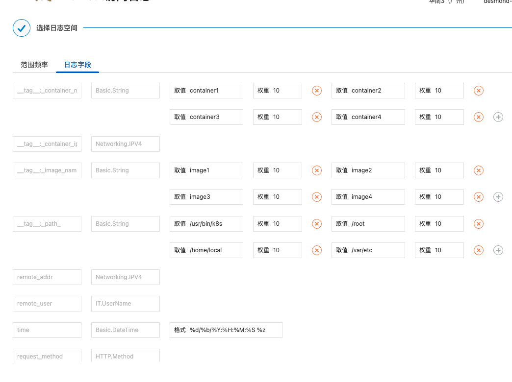

# 目的

- 项目上需要一个发送大量数据的脚本，但是现在的都比较难用，而且对测试，一线人员等都不友好，压测机器也比较难用
- 需要一个操作简单，发送大量数据的工具
- 具有可结合的多场景的（类似于阿里的数据模拟接入）

# 工具特点

- 操作简单，可以通过api提交任务，或者使用简单页面提交任务
- 后端通过文件形式管理配置，不依赖任何第三方组件，使用轻量化
- 可以发送大量数据，python使用大量进程进行发送数据
- 可以预设发送数据模型，提前预览数据模型的数据发送曲线
- 数据类型可以随意拼接，符合多种场景
- 发送场景可以合并，形成一个更加广泛的场景

# 项目使用简介

- 数据类型产生：Faker
- 调度引擎：
- 配置模版解析：
- 接口框架：fastAPI
- 前端低代码：https://www.jiandaoyun.com/dashboard#/

# 其他说明

[使用说明](./docs/user-manual.md)

[支持类型说明](./docs/data-type.md)

[任务配置说明](./docs/task-configration.md)

[项目架构设计说明](./docs/project-construct.md)